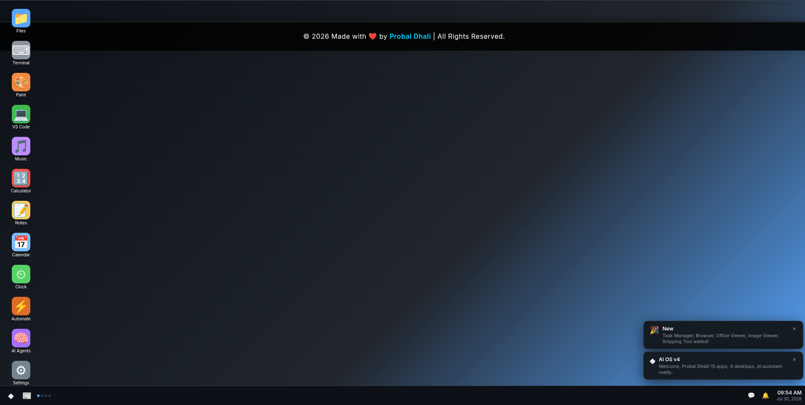
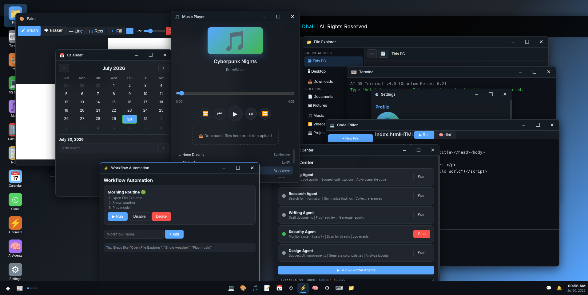
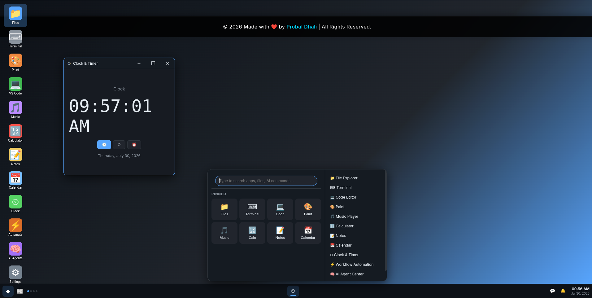

# 🤖 NexOS

> A modern web-based AI-powered operating system interface built with **HTML, CSS, and JavaScript** featuring a desktop environment, window management, AI assistant, widgets, virtual desktop concepts, and productivity applications.



---

## ✨ Features

### 🖥️ Desktop Environment
- Modern desktop UI
- Desktop icons
- Right-click context menu
- Start Menu
- Taskbar
- System Tray
- Live Clock & Date
- Notification Center

### 🤖 AI Assistant
- Interactive AI Chat Panel
- Voice Input
- Quick AI Suggestions
- Open applications using AI commands
- Basic calculations
- Weather queries
- Productivity shortcuts

### 🪟 Window Manager
- Draggable windows
- Resizable windows
- Minimize
- Maximize
- Close
- Snap layouts
- Window focus
- Alt + Tab switcher

### 📂 Applications
- File Explorer
- Terminal
- VS Code Editor
- Paint
- Music Player
- Calculator
- Notes
- Calendar
- Timer & Clock
- Workflow Automation
- AI Agent Center
- Settings

### 📊 Widgets
- System Monitor
- CPU Usage
- Memory Usage
- Disk Usage
- Network Status
- Weather Widget
- Quick Actions

### 🔔 Productivity
- Notification Center
- Calendar Flyout
- Snipping Tool
- Virtual Desktop Indicator
- Jump Lists
- Desktop Shortcuts

### 🎨 User Experience
- Welcome Wizard
- User Profile Setup
- Avatar Upload
- Smooth Animations
- Responsive Layout
- Beautiful Modern UI

---

# 📸 Preview

## Desktop


---

## AI Assistant



---

## Applications



---

# 📁 Project Structure

```
NexOS/
│
├── index.html
├── styles.css
├── app.js
│
├── preview/
│   ├── preview1.png
│   ├── preview2.png
│   └── preview3.png
│
├── LICENSE
└── README.md
```

---

# 🚀 Getting Started

## Clone the repository

```bash
git clone https://github.com/Probal2005/NexOS.git
```

## Open the project

```bash
cd NexOS
```

Simply open **index.html** in your browser.

Or use **VS Code Live Server** for the best experience.

---

# ⌨️ Keyboard Shortcuts

| Shortcut | Action |
|-----------|--------|
| Alt + Space | Open AI Assistant |
| Alt + Tab | Switch Windows |
| Double Click | Open Desktop App |
| Right Click | Desktop Context Menu |

---

# 🛠️ Technologies Used

- HTML5
- CSS3
- JavaScript (ES6)
- Web APIs

---

# 🎯 Roadmap

- [ ] Real File System
- [ ] Browser App
- [ ] Video Player
- [ ] Terminal Commands
- [ ] Package Manager
- [ ] AI Automation
- [ ] Cloud Sync
- [ ] User Accounts
- [ ] Themes
- [ ] Extensions
- [ ] Plugin Marketplace
- [ ] PWA Support

---

# ❤️ Author

**Probal Dhali**

GitHub

https://github.com/Probal2005

---

# 🤝 Contributing

Contributions are welcome!

1. Fork the repository

2. Create a feature branch

```bash
git checkout -b feature/NewFeature
```

3. Commit changes

```bash
git commit -m "Add New Feature"
```

4. Push

```bash
git push origin feature/NewFeature
```

5. Open a Pull Request

---

# ⭐ Support

If you like this project,

⭐ Star this repository on GitHub.

It really helps!

---

# 📄 License

This project is licensed under the MIT License.

---

## Made with ❤️ by Probal Dhali